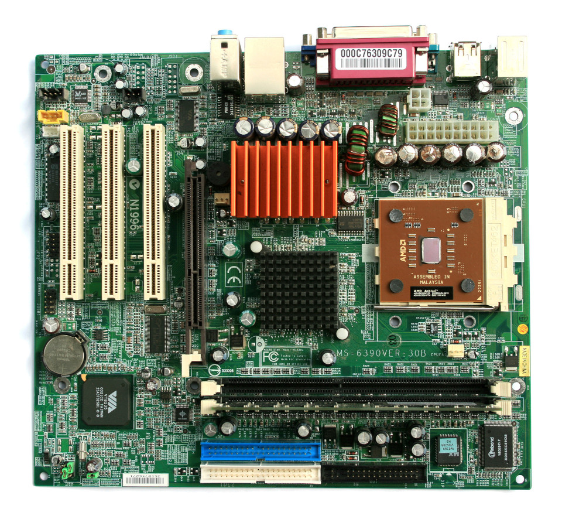
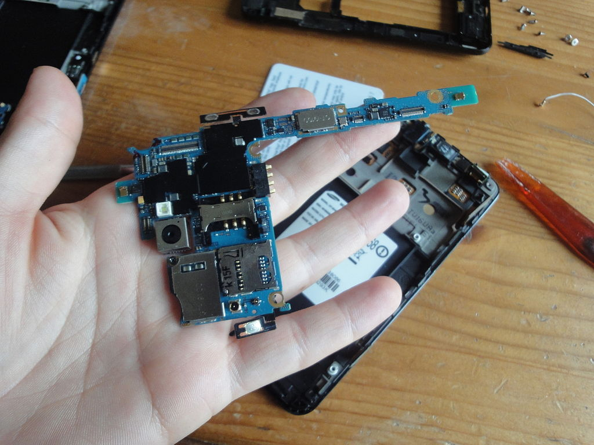
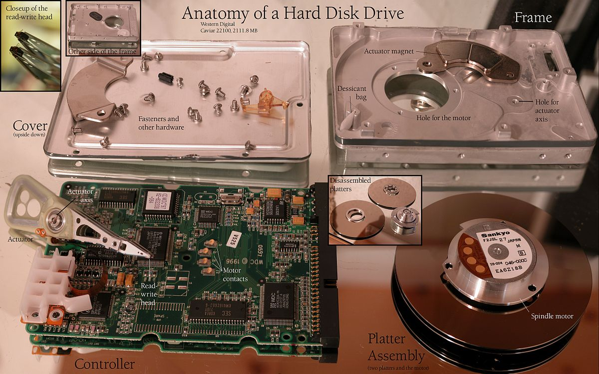
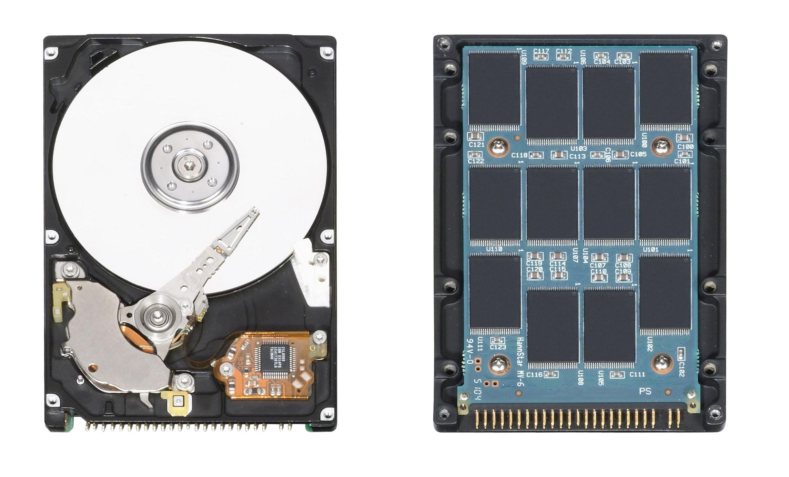

# Introdução

O que é um computador? \pause

- No passado: uma pessoa que faz cálculos (computa) \pause

- Atualmente: uma máquina que pode ser programada para executar sequências de instruções (operações lógicas e aritméticas) automaticamente

# Introdução

O que é um sistema computacional? \pause

- Um conjunto completo de elementos que permite o uso do computador \pause

- Inclui hardware e software

# Exemplos

Propósito geral \pause

- Computadores pessoais
- _Smartphones_
- _Tablets_

\pause

Propósito específico

- Tocador de música
- Eletrodomésticos
- Automóveis
- Controle industrial

# Funcionamento básico

Como funciona um sistema computacional? \pause

- Entrada
- Processamento
- Saída

# Hardware

Componentes \pause

- Dispositivos de entrada/saída
- Dispositivos de armazenamento
- Memória
- Processador

\pause

A interligação entre esses componentes é feita pela placa-mãe.

# Placa-mãe de um computador de mesa

{ width=7.5cm }

# Placa-mãe de um _smartphone_

{ width=7.5cm }

# Componentes / Dispositivos de entrada

Fornecem dados para serem processadas e armazenados. \pause Exemplos \pause

- Teclado
- Mouse
- Microfone
- Câmera
- Sensores
- Tela sensível ao toque

# Componentes / Dispositivos de saída

Apresentam ou transmitem dados recuperados do armazenamento e resultados do processamento. \pause Exemplos \pause

- Monitor
- Impressora
- Auto falante
- Atuadores

# Componentes / Dispositivos de entrada e saída

Dispositivos híbridos \pause

- Adaptadores de rede
- Dispositivos de armazenamento

# Componentes / Dispositivos de armazenamento

Retêm dados para recuperação posterior. \pause Exemplos \pause

- Eletrônico \pause
    - ROMs (memória apenas para leitura)
    - SSD (disco de estado sólido) \pause
- Magnético \pause
    - Disquetes (discos flexíveis)
    - HDD (discos rígidos) \pause
- Óptico
    - CD
    - DVD

# Componentes de um HDD

{ width=10cm }

# Funcionamentos de um HDD

Vídeos mostrando o funcionamentos de um HDD

- \url{https://en.wikipedia.org/wiki/File:HardDisk1.ogv}

- \url{https://en.wikipedia.org/wiki/File:Harddrive-engineerguy.ogv} (Você pode escolher a legenda em português clicando em cc)

# HDD vs SDD

{ width=10cm }

# HDD vs SDD

SSD

- Mais rápido
- Menor capacidade
- Mais caro

HDD

- Mais lento
- Maior capacidade
- Mais barato

# Componentes / Memória

Memória principal \pause

- Armazena informações para uso imediato
- Volátil (requer energia para manter os dados armazenados) \pause
- Mais rápida do que os dispositivos de armazenamento

# Componentes / Processador

Processador ou CPU (unidade central de processamento) \pause

- Registradores
    - Memória muito rápida que armazena os operandos e os resultados das operações
- Unidade lógica e aritmética (ULA)
    - Lê os operandos dos registradores
    - Executa operações
    - Grava o resultado nos registradores
- Unidade de controle
    - Coordena a leitura das instruções da memória e execução pela ULA

\pause

{ width=6cm }

# Hierarquia de memória

Por que existem tantos tipos de memória? \pause

Porque cada uma tem características específicas de capacidade, velocidade e custo.

# Hierarquia de memória

{ width=8cm }

# Conjunto de instruções

Cada processador executa um conjunto específico de instruções (descrito por uma arquitetura) \pause

- X86, AMD64 (computadores em geral)
- Arm, Aarch64 (dispositivos portáteis)
- Mips (roteadores)

# Atividades

@. Identifique os componentes do seu computador ou _smartphone_:
    - Tipo de tecnologia e capacidade dos dispositivos de armazenamento
    - Dispositivos de entrada
    - Dispositivos de saída
    - Capacidade da memória principal
    - Arquitetura do processador

@. Os vídeo games são dispositivos de propósito geral ou específico?

# Atividades

@. Identifique em sua casa um dispositivo que contenha um sistema computacional de propósito específico e tente explicar:
    - Quais são as entrada do sistema
    - Qual é o processamento que o sistema realiza
    - Quais são as saídas do sistema

# Atividades

Responda:

@. Qual a utilidade de um sistema computacional sem dispositivos de entrada?

@. Qual a utilidade de um sistema computacional sem dispositivos de saída?
