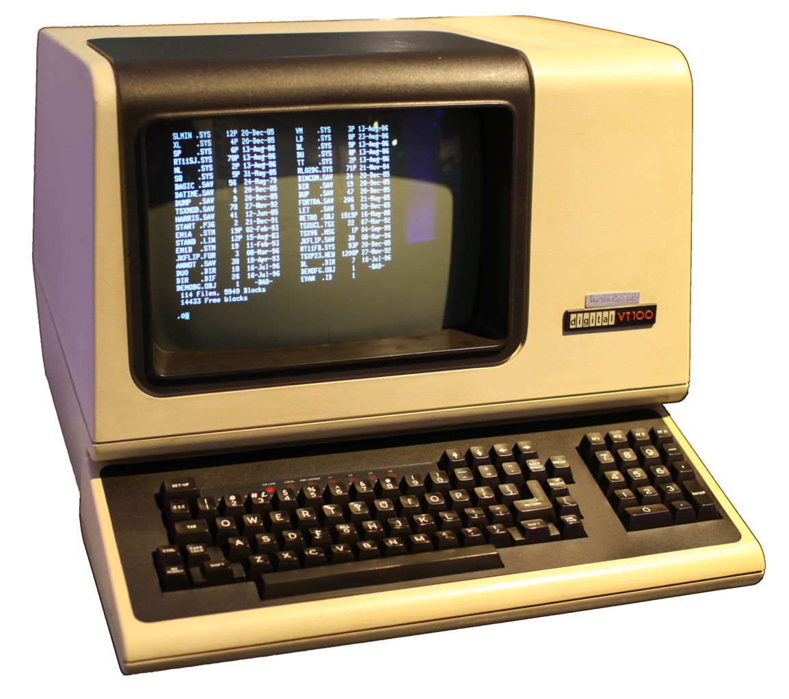

# Introdução

O que é um software? \pause

Uma coleção de instruções que dizem o que um computador deve fazer.

# Licença

Antes de conversarmos sobre diferentes aspectos dos softwares, vamos falar de licença de software. \pause

O que é uma licença de software? \pause

É um documento que descreve um contrato entre o fornecedor do software e o usuário do software.

# Tipos de software

De forma geral, os software podem ser classificadas de acordo com a sua licença em

- Software proprietário

- Software livre

# Tipos de software

Software proprietário

- Restringe de alguma maneira a execução, distribuição, modificação, etc.

- Suporte ao usuário geralmente fornecido pela empresa que vende/distribui o software. \pause

- Variantes: shareware, adware, etc. \pause

Exemplos \pause

- Photoshop

- Microsoft Office

- Google Chrome

# Tipos de software

Software livre

- Permite a execução, redistribuição, modificação do código, etc.

- Algumas licenças requerem a redistribuição do código se ele for modificado.

- Suporte ao usuário geralmente fornecido pela comunidade de usuários e desenvolvedores \pause

Exemplos \pause

- Gimp

- Libreoffice

- Mozilla Firefox

# {.plain}

{width=9cm}

# Boot

Qual é o primeiro programa executado quando ligamos o computador? \pause

- Firmware (BIOS ou UEFI) \pause

E depois? \pause

- Sistema Operacional

# Sistema Operacional

Quais são os papéis do sistema operacional? \pause

- Gerenciar os recursos do sistema computacional \pause

- Prover serviços para outros softwares \pause

Alguns componentes \pause

- Kernel (gerência de processos, memória, entrada/saída, etc)

- Interface com o usuário (shell)

# {.plain}

{height=7cm}

# Sistema Operacional

Exemplos de sistemas operacionais proprietários \pause

- Windows 10 \pause

- macOS, iOS \pause

- Android, ChromeOS \pause

Exemplos de sistemas operacionais livres \pause

- Linux (Debian, Ubuntu, Android, ChromeOS, etc) \pause

- FreeBSD, OpenBSD, NetBSD \pause

- FreeDOS, ReactOS

# {.plain}

{height=6cm}

{height=6cm}

{height=6cm}

# Shell

A iteração entre o sistema operacional e o usuário final é feita através de um _Shell_ (lançador em dispositivos móveis).

Um _Shell_ pode oferecer uma interface gráfica ou interface textual. \pause

Quais as principais características de cada tipo de interface?

# Shell

Shell Gráfico \pause

- Geralmente utilizam a metáfora de área de trabalho \pause
- Facilidade de uso e aprendizado \pause
- Menos poderosos \pause

Shell Texto \pause

- Comandos descritos por texto
- Mais difíceis de aprender
- Mais ágeis
- Mais poderosos

# Shell Gráfico

# Shell Texto

{ width=7cm }

{ width=3cm }

# Terminal

{width=7cm}

# Atividades

@. Identifique o sistema operacional do seu computador. Inclua a versão, o desenvolvedor e o tipo de licença.

@. Liste os softwares livres que você utiliza.

@. Experimente um shell textual no seu computador e relate como foi a sua experiência.

@. Experimente um shell gráfico alternativo no seu computador e relate como foi a sua experiência.

@. Selecione três softwares proprietários que você utiliza e pesquise alternativas em software livre.
