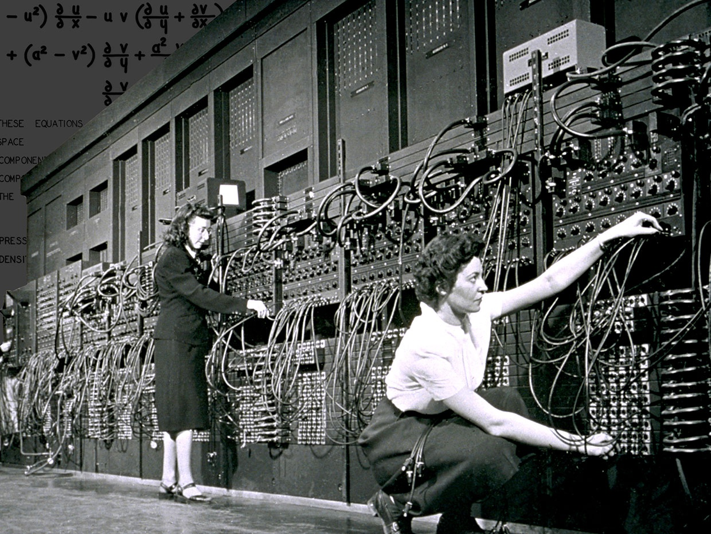

# Introdução

Como descrever o que um computador deve fazer? \pause

Usando uma linguagem. \pause

Mas o que é uma linguagem e qual a sua função? \pause

Um sistema estruturado para comunicação.


# Introdução

Podemos utilizar o português para programar um computador? \pause

Não, porque o computador não entende o português! \pause Ainda que o computador entendesse o português, ele não seria uma linguagem adequada para programação porque não é preciso o bastante. \pause

E que linguagem o computador entende? \pause

Cada tipo de computador entende uma linguagem específica, a sua linguagem de máquina. \pause

Então, precisamos programar um computador usando sua linguagem de máquina? \pause

Hoje em dia não, mas os primeiros computadores eram programados usando linguagem de máquina!

# {.plain}




# Tradução

Se não queremos utilizar linguagem de máquina, como podemos programar os computadores? \pause Como duas entidades que usam linguagens diferentes podem se comunicar? \pause

Usando um tradutor.\pause

Se a linguagem fonte e a linguagem alvo forem bem definidas, podemos escrever um programa que faça a tradução de forma automática. \pause A linguagem alvo (de máquina) é bem definida, precisamos de uma linguagem fonte (de programação) que também seja bem definida.


# Linguagem de programação

Uma **linguagem de programação** é uma linguagem formal (bem definida) adequada para programar computadores. \pause

Uma linguagem de programação é caracterizada por diversos aspectos, entre eles a sintaxe, a semântica e o modo de execução.


# Sintaxe

A **sintaxe** de uma linguagem é o conjunto de regras que define como os símbolos podem ser agrupados para criar as sentenças na linguagem. \pause

Por exemplo, a instrução para soma de dois número é expressa: \pause

- Na maioria das linguagens: `20 + 17`{.python} \pause
- Em Lisp: `(+ 20 17)`{.scheme}


# Semântica

A **semântica** de uma linguagem define o significado das construções da linguagem. \pause

A expressão `12 + "3"`{.python} é valida sintaticamente em muitas linguagens, mas o significado é diferente entre elas. \pause

- Lua: o texto `"3"`{.python} deve ser convertido para um número e depois somado com `12`{.python}. \pause
- Javascrip: o número `12`{.python} deve ser transformado para um texto e depois juntado com `"3"`{.python}. \pause
- Na maioria linguagens: é um erro semântico.


# Modo de execução

Os dois principais **modos de execução** das linguagens de programação são a compilação e a interpretação. \pause

Em uma linguagem compilada o código do programa é primeiro traduzido (compilado) para código de máquina e posteriormente executado. \pause

Em uma linguagem interpretada o código do programa é lido, traduzido e executado diretamente pelo interpretador.


# Exemplo C++

<div class="columns">
<div class="column" width="50%">

Exemplo em C++ - Raiz quadrada

Parte do arquivo `raiz.cpp`

\small

```cpp
// Entrada
double n = stof(argv[1]);
double c = stof(argv[2]);

// Processamento
while (abs(c * c - n) >= 0.1) {
    double c_ = (c + n / c) / 2;
    c = c_;
}

// Saída
cout << c << endl;
```

\pause
</div>
<div class="column" width="50%">
\small

**Windows**

Compilação

```
g++ -o raiz.exe raiz.cpp
```

\pause


Execução

```
> raiz.exe 4 1
2.00061
```

\pause

**Linux**

Compilação

```
g++ -o raiz raiz.cpp
```

\pause


Execução

```
> ./raiz 4 1
2.00061
```
</div>
</div>


# Exemplo Python

<div class="columns">
<div class="column" width="50%">

Exemplo em Python - MDC

Parte do arquivo `mdc.py`

\footnotesize

```python
# Entrada
a = int(sys.argv[1])
b = int(sys.argv[2])
# Processamento
if a < b:
    a, b = b, a
while b != 0:
    c = a - b
    a = b
    b = c
    if a < b:
        a, b = b, a
# Saída
print(a)
```

\pause
</div>
<div class="column" width="50%">
Interpretação

```
> python3 mdc.py 52 36
4
```

</div>
</div>


# Escolhendo uma linguagem

Existem centenas de linguagens de programação, cada uma com suas próprias características e usos, então, qual delas aprender? \pause

Nenhuma em particular. \pause O mais importante não são as linguagens em si, mas os princípios que são utilizados para criar os programas nas linguagens. \pause

Dominando os fundamentos de algoritmos e paradigmas de programação, aprender uma nova linguagem não é uma tarefa difícil!


# Escolhendo uma linguagem

Mas precisamos de uma linguagem para começar. \pause Nessa disciplina vamos utilizar a linguagem Python! \pause

Python é uma linguagem bastante utilizada e versátil, \pause mas também é uma linguagem extensa! \pause Mas não se preocupe, vamos utilizar apenas construções básicas! \pause

Vamos começar?


# Atividades

@. Tente relacionar as construções do fluxograma do algoritmo que calcula a raiz quadrada com as construções do código em C++.

@. Tente relacionar as construções do pseudo código que calcula o MDC com as construções do código em Python.

@. Uma linguagem pode surgir a partir de processos naturais?
